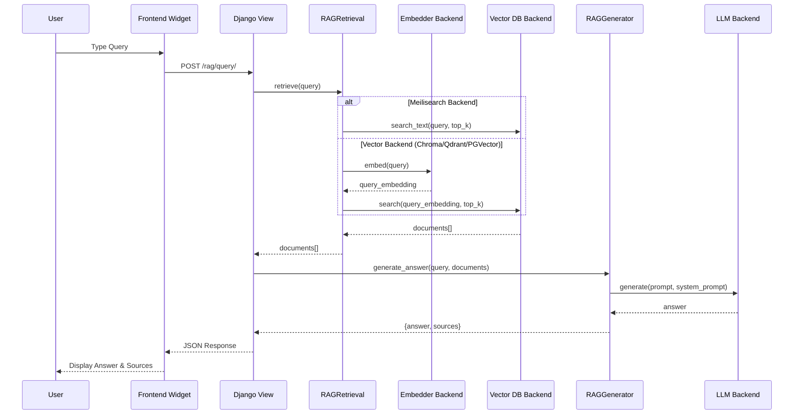
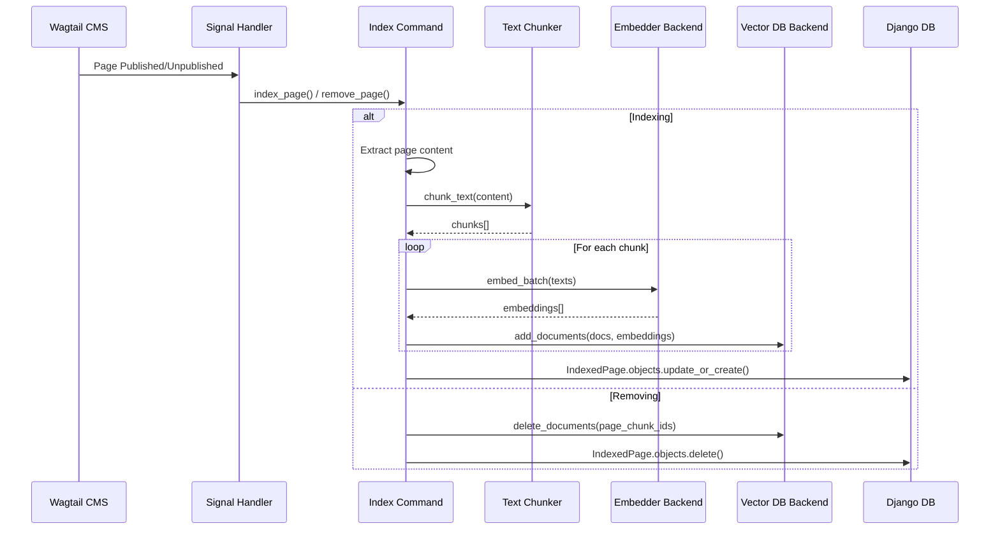

# Architecture

This document describes the architecture of Wagtail Context Search and how user queries flow through the system.

## Overview

Wagtail Context Search is a RAG (Retrieval-Augmented Generation) system that enables intelligent search and Q&A over your Wagtail site content. It uses vector embeddings to find relevant content and LLMs to generate contextual answers.

## System Architecture

```
┌─────────────────────────────────────────────────────────────────────────┐
│                          WAGTAIL CONTEXT SEARCH                          │
│                              Architecture                                │
└─────────────────────────────────────────────────────────────────────────┘

┌──────────────┐
│   Frontend   │
│  (Browser)   │
└──────┬───────┘
       │
       │ 1. User Query
       ▼
┌─────────────────────────────────────────────────────────────────────┐
│                      Django Application Layer                         │
│                                                                       │
│  ┌──────────────┐    ┌──────────────┐    ┌──────────────────┐      │
│  │   URLs.py    │───▶│  Views.py    │───▶│  RAGRetrieval    │      │
│  │ /rag/query/  │    │ query_view() │    │                  │      │
│  └──────────────┘    └──────────────┘    └────────┬─────────┘      │
│                                                     │                │
│                                                     │ 2. Retrieve    │
│                                                     ▼                │
│                                          ┌──────────────────────┐   │
│                                          │  Embedder Backend    │   │
│                                          │  (OpenAI/Sentence    │   │
│                                          │   Transformers)      │   │
│                                          └──────────┬───────────┘   │
│                                                     │                │
│                                                     │ 3. Embedding   │
│                                                     ▼                │
│                                          ┌──────────────────────┐   │
│                                          │  Vector DB Backend   │   │
│                                          │  (Chroma/Meilisearch │   │
│                                          │   /PGVector/Qdrant)  │   │
│                                          └──────────┬───────────┘   │
│                                                     │                │
│                                                     │ 4. Documents   │
│                                                     ▼                │
│                                          ┌──────────────────────┐   │
│                                          │  RAGGenerator        │   │
│                                          │                      │   │
│                                          └──────────┬───────────┘   │
│                                                     │                │
│                                                     │ 5. Generate    │
│                                                     ▼                │
│                                          ┌──────────────────────┐   │
│                                          │  LLM Backend         │   │
│                                          │  (OpenAI/Anthropic/  │   │
│                                          │   Ollama)            │   │
│                                          └──────────────────────┘   │
└─────────────────────────────────────────────────────────────────────┘
       │
       │ 6. Response
       ▼
┌──────────────┐
│   Frontend   │
│  (Browser)   │
└──────────────┘
```

## Query Flow

### Step 1: User Query Submission

**Frontend (JavaScript Widget)**
- User types query in the chat widget
- JavaScript sends POST request to `/rag/query/`
- Includes CSRF token and query payload

**Location:** `wagtail_context_search/static/wagtail_context_search/js/assistant.js`

```javascript
fetch(this.apiUrl, {
    method: 'POST',
    headers: {
        'Content-Type': 'application/json',
        'X-CSRFToken': csrftoken,
    },
    body: JSON.stringify({ query: query, stream: false }),
})
```

### Step 2: Django View Processing

**Django View Handler**
- Receives POST request at `/rag/query/`
- Validates query and configuration
- Initializes RAGRetrieval and RAGGenerator
- Coordinates retrieval and generation

**Location:** `wagtail_context_search/views.py`

```python
@csrf_exempt
@require_http_methods(["POST"])
def query_view(request):
    config = get_config()
    retrieval = RAGRetrieval(config)
    documents = retrieval.retrieve(query)
    generator = RAGGenerator(config)
    result = generator.generate_answer(query, documents)
    return JsonResponse(result)
```

### Step 3: Document Retrieval (RAGRetrieval)

**Retrieval Process:**

1. **Query Embedding Generation**
   - Uses configured Embedder backend (OpenAI or Sentence Transformers)
   - Converts user query text into a vector embedding
   - Embedding dimension depends on model (e.g., 384 for all-MiniLM-L6-v2, 1536 for OpenAI)

2. **Vector Database Search**
   - Searches vector DB for similar document embeddings
   - Returns top-k most relevant documents (default: 5)
   - Documents include: text, metadata (title, url, page_id), and similarity score

   **Special Case - Meilisearch:**
   - Meilisearch uses full-text search instead of vector similarity
   - Query text is passed directly to `search_text()` method
   - No embedding generation needed for search (embeddings still stored)

**Location:** `wagtail_context_search/core/retrieval.py`

```python
class RAGRetrieval:
    def retrieve(self, query: str, top_k: int = None):
        # Generate query embedding
        query_embedding = self.embedder.embed(query)
        
        # Search vector database (or use text search for Meilisearch)
        if hasattr(self.vector_db, 'search_text'):
            documents = self.vector_db.search_text(query, top_k=top_k)
        else:
            documents = self.vector_db.search(
                query_embedding=query_embedding,
                top_k=top_k,
            )
        return documents
```

**Vector DB Backends:**
- **ChromaDB:** Cosine similarity search over embeddings
- **PostgreSQL/pgvector:** Vector similarity search using pgvector extension
- **Qdrant:** Vector similarity search with optional filtering
- **Meilisearch:** Full-text search (text-based, not vector-based)

### Step 4: Answer Generation (RAGGenerator)

**Generation Process:**

1. **Prompt Construction**
   - Builds system prompt with instructions for the LLM
   - Formats retrieved documents as context
   - Includes user query
   - Template ensures LLM uses only provided context

2. **LLM Generation**
   - Sends prompt to configured LLM backend
   - Receives generated answer
   - Handles errors gracefully

3. **Source Extraction**
   - Extracts metadata from retrieved documents
   - Formats sources with titles and URLs
   - Returns answer with source attribution

**Location:** `wagtail_context_search/core/generator.py`

```python
class RAGGenerator:
    def generate_answer(self, question: str, documents: List[Dict]):
        # Build prompt with context
        system_prompt, user_prompt = self.prompt_template.build_prompt(
            question, documents
        )
        
        # Generate answer using LLM
        answer = self.llm.generate(
            prompt=user_prompt,
            system_prompt=system_prompt,
        )
        
        # Extract sources
        sources = [
            {
                "title": doc["metadata"].get("title"),
                "url": doc["metadata"].get("url"),
            }
            for doc in documents
        ]
        
        return {"answer": answer, "sources": sources}
```

**LLM Backends:**
- **OpenAI:** Uses GPT models via OpenAI API
- **Anthropic:** Uses Claude models via Anthropic API
- **Ollama:** Uses local LLM models via Ollama API

### Step 5: Response Delivery

**Response Format:**
```json
{
    "answer": "The answer generated by the LLM...",
    "sources": [
        {
            "title": "Page Title",
            "url": "https://example.com/page/",
            "score": 0.85
        }
    ]
}
```

**Frontend Display:**
- JavaScript receives JSON response
- Displays answer in chat widget
- Renders source links as clickable URLs
- Formats message with appropriate styling

## Indexing Flow

Content indexing happens in a separate flow:

```
┌──────────────┐
│ Wagtail Page │
│  Publish/    │
│  Unpublish   │
└──────┬───────┘
       │
       │ Signal
       ▼
┌─────────────────────┐
│   Signals.py        │
│  page_published /   │
│  page_unpublished   │
└──────┬──────────────┘
       │
       │ Index/Remove
       ▼
┌──────────────────────────────────┐
│      Management Flow              │
│                                   │
│  1. Extract page content          │
│  2. Chunk text (512 char chunks)  │
│  3. Generate embeddings           │
│  4. Store in Vector DB            │
│  5. Update IndexedPage model      │
└──────────────────────────────────┘
```

**Key Components:**

1. **Wagtail Signals:** Automatically trigger on page publish/unpublish
2. **Content Extraction:** Extracts text from page content blocks
3. **Text Chunking:** Splits long content into smaller chunks with overlap
4. **Embedding Generation:** Generates embeddings for each chunk
5. **Vector DB Storage:** Stores chunks with embeddings and metadata

**Location:** 
- `wagtail_context_search/signals.py` - Signal handlers
- `wagtail_context_search/management/commands/rag_index.py` - Indexing logic
- `wagtail_context_search/core/chunker.py` - Text chunking
- `wagtail_context_search/core/retrieval.py` - Document addition

## Component Details

### Backend Interfaces

All backends implement abstract base classes:

**BaseVectorDB Interface:**
```python
class BaseVectorDB(ABC):
    def add_documents(documents, embeddings) -> None
    def search(query_embedding, top_k, filter_dict) -> List[Dict]
    def delete_documents(document_ids) -> None
    def delete_all() -> None
    def is_available() -> bool
    def get_stats() -> Dict
```

**BaseLLMBackend Interface:**
```python
class BaseLLMBackend(ABC):
    def generate(prompt, system_prompt, **kwargs) -> str
    def is_available() -> bool
    def stream_generate(prompt, system_prompt, **kwargs) -> Generator
```

**BaseEmbedder Interface:**
```python
class BaseEmbedder(ABC):
    def embed(text: str) -> List[float]
    def embed_batch(texts: List[str]) -> List[List[float]]
    def get_dimension() -> int
    def is_available() -> bool
```

### Configuration System

Configuration is managed through Django settings with a merge system:

1. Default configuration in `wagtail_context_search/settings.py`
2. User overrides in Django `settings.py` via `WAGTAIL_CONTEXT_SEARCH`
3. Deep merge for nested structures (e.g., `BACKEND_SETTINGS`)
4. Backend-specific settings extracted automatically

**Location:** `wagtail_context_search/settings.py`

## Data Flow Diagram

### Query Flow (Mermaid)



### Indexing Flow (Mermaid)



## Performance Considerations

1. **Embedding Generation:** Can be slow for large batches. Batch processing is used where possible.
2. **Vector Search:** Optimized with indexes in vector databases. Top-k search limits result size.
3. **LLM Generation:** Can be slow. Streaming support available for better UX.
4. **Caching:** Consider caching frequent queries if needed (not implemented by default).

## Security Considerations

1. **CSRF Protection:** Views use `@csrf_exempt` but token is still sent from frontend.
2. **Input Validation:** Query is validated before processing.
3. **Error Handling:** Errors are logged but not exposed to users in detail.
4. **API Keys:** Stored in Django settings, should use environment variables.

## Scalability

1. **Vector Database:** Can scale horizontally (Qdrant, Meilisearch) or vertically (ChromaDB, PGVector).
2. **LLM Backends:** API-based backends scale with provider infrastructure.
3. **Embedding Models:** Local models (Sentence Transformers) can be optimized with GPU.
4. **Django:** Standard Django scaling applies (load balancing, caching, etc.).

## Extensibility

The plugin is designed for extensibility:

1. **New Backends:** Implement base interfaces to add new LLM/Embedder/VectorDB backends.
2. **Custom Chunking:** Modify chunker for different strategies.
3. **Custom Prompts:** Override prompt templates in generator.
4. **Custom UI:** Override templates and static files.

See `docs/DEVELOPER.md` for more details on extending the system.
