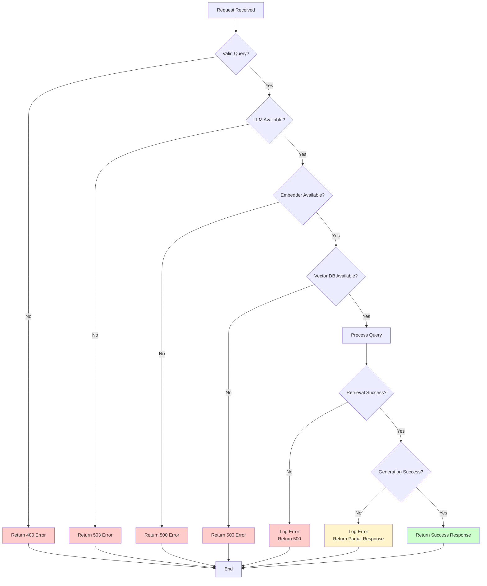

# Architecture Diagrams

Visual diagrams for understanding the Wagtail Context Search architecture.

## Query Processing Flow

```mermaid
graph TD
    A[User Types Query] --> B[Frontend Widget]
    B -->|POST /rag/query/| C[Django View: query_view]
    C -->|Initialize| D[RAGRetrieval]
    C -->|Initialize| E[RAGGenerator]
    
    D -->|1. Embed Query| F[Embedder Backend]
    F -->|query_embedding| D
    
    D -->|2. Search| G{Vector DB Backend}
    G -->|ChromaDB| H[ChromaDB<br/>Vector Search]
    G -->|Meilisearch| I[Meilisearch<br/>Full-Text Search]
    G -->|PGVector| J[PostgreSQL<br/>pgvector]
    G -->|Qdrant| K[Qdrant<br/>Vector Search]
    
    H -->|documents[]| D
    I -->|documents[]| D
    J -->|documents[]| D
    K -->|documents[]| D
    
    D -->|documents[]| C
    C -->|query + documents| E
    
    E -->|3. Build Prompt| L[Prompt Template]
    L -->|formatted_prompt| E
    
    E -->|4. Generate Answer| M{LLM Backend}
    M -->|OpenAI| N[GPT Models]
    M -->|Anthropic| O[Claude Models]
    M -->|Ollama| P[Local LLM]
    
    N -->|answer| E
    O -->|answer| E
    P -->|answer| E
    
    E -->|answer + sources| C
    C -->|JSON Response| B
    B -->|Display| A
    
    style A fill:#e1f5ff
    style B fill:#fff4e1
    style C fill:#ffe1f5
    style D fill:#e1ffe1
    style E fill:#ffe1e1
    style F fill:#f0e1ff
    style G fill:#ffffe1
    style M fill:#ffffe1
```

## System Components


## Indexing Flow


## Data Model

```mermaid
erDiagram
    Page ||--o| IndexedPage : "has"
    IndexedPage ||--o{ ChunkMetadata : "has"
    
    Page {
        int id PK
        string title
        string slug
        datetime first_published_at
        datetime last_published_at
        bool live
    }
    
    IndexedPage {
        int page_id PK_FK
        string page_type
        string title
        url url
        datetime last_indexed
        datetime last_modified
        int chunk_count
        bool is_active
    }
    
    ChunkMetadata {
        int id PK
        int page_id FK
        string chunk_id
        int chunk_index
        text chunk_text
    }
    
    VectorDB {
        string chunk_id PK
        vector embedding
        text text
        json metadata
    }
```

## Backend Selection


## Complete System Architecture


## Query Processing States


## Error Handling Flow



These diagrams can be rendered using Mermaid support in Markdown viewers like GitHub, GitLab, or documentation tools like MkDocs.
